# Agents for Data Quality — NoiPA

**A multi-agent pipeline that audits a raw public-administration CSV, repairs it under human approval, and scores what it delivered.**

**Team members:** Allam Eliya, Cervelli Mattia, Filosofi Simone

This repository documents a project developed for the Machine Learning course, academic year 2025/26, in collaboration with Reply. The project studies how a **multi-agent LLM pipeline behind a human approval gate** can be used to detect data quality defects in a raw CSV, attach a corrective action to every defect it finds, apply only what a reviewer approves, and produce a data quality report carrying **identified anomalies, correction suggestions and a reliability score**. The system is tailored to **NoiPA (MEF) administrative data**: HR, payroll and public expenditure records, in which disguised nulls, columns duplicated under different names, drifting value formats and legacy codes are the norm rather than the exception.

The **central idea** is that a data quality defect is not one kind of object, and that treating it as one is exactly what makes naive LLM cleaning unaccountable. A wrong dtype, a null hiding behind the string `N/D`, two columns holding the same field under different names, a value contradicting the row it sits in, and a statistical outlier are five different problems. They rest on different evidence, they carry different risk, and they deserve **different authority**. That last point is what the architecture is built around. Some may be applied by the system on its own. Some may only ever be *proposed* to a human. And some have no honest fix at all and must be reported as such.

### At a glance

Three NoiPA datasets, each run end to end with every proposal approved so that the full remediation
path is exercised. No run finished with an error.

| Dataset | Rows × columns | Reliability, like-for-like | Violations detected → residual |
|---|---|---|---|
| `spesa.csv` | 7,543 × 18 | 0.9380 → **0.9960** | 18,459 → 1,633 |
| `attivazioniCessazioni.csv` | 20,102 × 19 | 0.8652 → **0.9798** | 50,315 → 7,343 |
| `ritenuteSindacali.csv` *(not developed against)* | 11,745 × 14 | 0.9268 → **0.9451** | 15,300 → 1,276 |

Every changed cell is recorded with the stage that changed it, and every violation left standing is
reported with the reason no repair was available. Section 4 unpacks all three runs.

### Contents

| Section | What it covers |
|---|---|
| [1. Introduction](#1-introduction) | the setting, the problem, the contribution, and how to run everything |
| [2. Methods](#2-methods) | the architecture, the twelve stages, the reliability score, and the safety of generated code |
| [3. Experimental Design](#3-experimental-design) | the six design transitions that produced the final system |
| [4. Results](#4-results) | the three recorded runs, in detail and side by side |
| [5. Conclusions](#5-conclusions) | what the results support, where the system fails, and what comes next |

Jump straight to [setup and commands](#16-reproducibility-and-environment), the
[approval gate](#245-the-human-approval-gate), or the
[three runs side by side](#411-the-three-runs-side-by-side).

---

## 1. Introduction

### 1.1 Project Context and Institutional Setting

The project originates from a **realistic operating scenario inspired by NoiPA**, the Italian Ministry of Economy and Finance platform that manages payroll and HR data for public-sector employees. NoiPA aggregates datasets produced by many separate administrations, each with its own conventions, export tooling and legacy history. The incoming files are then validated **manually, or not at all**.

Even assuming every source administration acts in good faith, that assumption fails in practice for a structural reason: nobody owns the schema across the boundary. What arrives is not corrupt data so much as *unreconciled* data. Our own measurements on `spesa.csv` illustrate every category:

- **Nulls that do not look like nulls.** Cells reading `N/D`, `-`, `?` or `9999` are counted as data by any tool that trusts `isna()`.
- **The same field under several names.** `cod_imposta`, `2cod_imposta` and `cod imposta ext` are one column wearing three headers.
- **Convention drift inside the header row itself.** `Tipo Imposta` beside `tipo_imposta`; `SPESA TOTALE` beside `spesa`; `_id` and `aggregation-time` and `ente%code` all breaking the registry's naming rule in different ways.
- **Format drift inside a column.** `rata`, an accounting period, mixing layouts that all mean the same month.
- **Representation noise.** `spesa` recorded to two decimals but carrying floating-point tails past them.
- **Columns that are nearly empty.** `note` and `fonte_dato` are over 98% null and cannot support any inference at all.

This context suits a multi-agent project because the **main difficulty is not detection**. Counting nulls is trivial. The difficulty is the **gap between noticing a defect and being allowed to act on it**: knowing which defects the data itself determines, which ones need a judgement a machine should not make alone, and which ones admit no fix. If those are not separated carefully, a cleaning run silently invents data, and the resulting file is worse than the dirty one because it now looks trustworthy.

### 1.2 Problem Statement

The problem is therefore broader than "clean this CSV". The task is to design a system that can **measure** a dataset against a canonical model and against itself, **classify** each finding by the kind of defect it is, **propose** a corrective action bound to that finding, **apply** only what has been authorised, and **verify** that what it delivered is better than what it received — on the same metric, measured the same way at both ends.

This distinction is essential. A generic instruction such as *"use an LLM to clean this dataset"* produces output that looks plausible and is very difficult to justify. It becomes unclear which cells changed, on whose authority they changed, whether a value was corrected or invented, and whether a number in the final report describes the run or was written to sound good. For a system that touches public payroll records, **that level of opacity is not acceptable**.

### 1.3 Core Contribution and Objective

The objective is a **multi-agent pipeline** that receives a raw CSV and produces **two outcomes**: a **remediated dataset with a cell-level audit trail** of every change and its cause, and a **data quality report** carrying the anomalies found, the correction suggested for each, and a reliability score measured before and after.

The practical goal is plain: fix what can be fixed, and say honestly what could not be. The **methodological goal** is about how. The claim is not that an LLM can clean data — it is that **the division of authority is the contribution**, and that the system works *because* of specific choices about who is allowed to decide what:

- **Deterministic code measures; the model never measures.** Every count, rate, bound and violation in this system is computed by `pandas` in `tools/`. An agent receives a bounded, pre-measured evidence bundle and is asked for a judgement over it — never for a number.
- **Value-level repair is generated code, gated four ways, and never run on this machine first.** The model writes a `clean_value(value)` function so that a format rule *generalises* rather than enumerating the values already observed. A static gate parses that source before anything runs; its **first execution ever happens in an isolated [E2B](https://e2b.dev/docs) cloud VM**, against the column's own values; a human then sees it verbatim; and a failure comes back as typed evidence rather than as a discarded attempt.
- **Anything that can lose or invent data is a typed operation**, drawn from a fixed catalogue, never free code.
- **Nothing structural is applied without human approval.** `apply_fixes` executes only the ids in `state.approved_fix_ids` and is a no-op otherwise.
- **A rule that can be checked by executing the fix lives in code, not in a prompt.** A prompt-stated rule can be ignored unnoticed.

The model is not decoration on this design; it is what makes the design feasible. Deciding that `cod imposta ext` and `cod_imposta` are the same field, that `descrizione` means what it means, or that a rare category is a legacy code rather than a typo, requires semantic judgement no amount of `pandas` supplies. But the LLM components are never standalone: the measurement is always done first, deterministically, and the model reasons only over the result.

### 1.4 Coverage of the Five Mandatory Areas

| Area | Implemented in | What it produces |
|---|---|---|
| **Schema validation** | `tools/safe_cast.py`, `tools/validate_column_names.py`, `agents/nan_handler.py` | dtype validation per column with non-destructive casting; naming-convention violations against the registry's regex |
| **Completeness analysis** | `tools/completeness.py`, `tools/detect_placeholders.py`, `agents/nan_handler.py` | disguised-null unmasking, fill rate per column and dataset-wide, missing values per row, sparse-column detection |
| **Consistency validation** | `tools/cross_column_checks.py`, `tools/arithmetic_identities.py`, `tools/duplicate_rows.py`, `agents/format_consistency.py`, `agents/duplicate_column.py` | mined functional dependencies, arithmetic contradictions, intra-column format specs, exact duplicates and key collisions, duplicate columns |
| **Anomaly detection** | `agents/anomaly_detector.py` | IQR outliers on measures, rare categorical values, with role detection so a code is never treated as a magnitude |
| **Remediation** | `agents/unified.py`, `agents/auto_remediation.py`, `agents/apply_fixes.py` | a corrective action per finding, or an explicit `UnaddressedViolations` entry stating why none exists |

### 1.5 Repository Structure and Technology Stack

The repository exposes **two execution surfaces over one pipeline**: `main.ipynb`, the explanatory notebook that runs the graph stage by stage and shows every intermediate artefact; and `app.py`, the Streamlit application that is *also* the human approval gate. `graph.py` additionally exposes the same nodes as a compiled LangGraph object for programmatic use. There is no separate CLI and no `src/` package — the pipeline is the repository root.

The stack combines `langgraph` and `langchain-core` for orchestration and typed state, [`langchain-deepseek`](https://python.langchain.com/docs/integrations/chat/deepseek/) for every chat call, `openai` for the embedding index behind canonical matching, `pydantic` for the artefact contracts, `pandas` and `numpy` for all deterministic measurement, [`e2b-code-interpreter`](https://e2b.dev/docs) for the first execution of generated cleaning code, and `streamlit` for the gate.

Of the twelve pipeline stages, **six call a model directly** (`profiler`, `semantic`, `duplicate_column`, `anomaly_detector`, `unified`, `report_generator`) and one (`format_consistency`) calls it indirectly through two tools. The remaining five are pure Python.

```text
Reply_multi-agents_project_810431/
|-- agents/                            # one LangGraph node per file
|   |-- baseline_builder.py            # resolves the schema registry into baseline.json
|   |-- profiler.py                    # detects the NoiPA domain and language
|   |-- semantic.py                    # canonical match, dtype, placeholders per column
|   |-- nan_handler.py                 # unmasks disguised nulls, enforces dtypes, completeness
|   |-- duplicate_column.py            # elects a canonical name among redundant columns
|   |-- format_consistency.py          # format specs, cross-column rules, arithmetic identities
|   |-- auto_remediation.py            # applies only what the data determines on its own
|   |-- anomaly_detector.py            # IQR outliers and rare categories
|   |-- unified.py                     # writes clean_value() code and typed FixProposals
|   |-- apply_fixes.py                 # executes ONLY approved_fix_ids
|   |-- duplicate_row.py               # removes exact duplicate rows
|   `-- report_generator.py            # the report payload and its narrative
|-- tools/                             # deterministic helpers (two exceptions call the model)
|   |-- generated_function.py          # static gate, sandbox and judge for generated code
|   |-- fix_invariants.py              # post-fix checks no remediation may violate
|   |-- reliability_score.py           # the five dimensions and the aggregate score
|   `-- ...                            # profiling, matching, validation, execution
|-- prompts/                           # one markdown prompt per LLM-calling agent
|-- utils/llm.py                       # the single construction point for the chat model
|-- tests/                             # 348 tests; no network and no API key required
|-- datasets_extra/                    # four further NoiPA CSVs, beyond the two required
|-- Datasets-Reply-20260313/           # the two datasets required by the brief
|-- images/                            # figures used by this README
|-- registry/                          # the canonical schema and its retrieval index
|   |-- noipa_schema_registry.json     # hand-curated canonical registry
|   |-- column_descriptions.json       # retrieval index for canonical matching
|   |-- column_descriptions.embeddings.pkl  # its cached embedding matrix
|   `-- baseline.json                  # the resolved registry, rewritten on every run
|-- docs/                              # the brief, the course guidelines, the presentation
|-- runs/                              # the recorded runs the notebook and the figures replay
|-- checks/                            # regression net over those runs; no API key needed
|   |-- verify.py                      # pins value-level invariants against invariants.json
|   |-- acceptance.py                  # the delivered artefacts are complete and consistent
|   `-- census.py                      # raw defects enumerated independently of the pipeline
|-- out/                               # scratch run artefacts (gitignored)
|-- models.py                          # the typed artefact contracts
|-- state.py                           # PipelineState, shared by every node
|-- graph.py                           # LangGraph wiring and the compiled default graph
|-- app.py                             # Streamlit GUI and human approval gate
|-- main.ipynb                         # explanatory notebook
|-- record_run.py                      # records one full run into runs/<dataset>/
|-- figures.py                         # the six figures, shared by this README and the notebook
|-- conftest.py
|-- requirements.txt
`-- .env                               # DEEPSEEK_API_KEY, OPENAI_API_KEY, E2B_API_KEY (local only)
```

### 1.6 Reproducibility and Environment

On **macOS / Linux**:

```bash
python3 -m venv .venv
source .venv/bin/activate
pip install -r requirements.txt
```

On **Windows (PowerShell)**:

```powershell
python -m venv .venv
.venv\Scripts\activate
pip install -r requirements.txt
```

Every LLM-calling stage requires a `DEEPSEEK_API_KEY`. Canonical matching by embedding retrieval additionally requires an `OPENAI_API_KEY`. `E2B_API_KEY` is **optional but recommended**: it moves the first execution of every generated cleaning function off this machine and into a cloud micro-VM. Without it that execution falls back to a restricted local namespace instead (the *local cage* of Section 2.6). The pipeline still runs, with a weaker isolation guarantee, and the report states which executor validated each function. Variables are loaded from `.env` at the repository root through `python-dotenv`:

```dotenv
DEEPSEEK_API_KEY=your_value_here
OPENAI_API_KEY=your_value_here
E2B_API_KEY=your_value_here   # optional
```

The GUI and approval gate:

```bash
streamlit run app.py
```

The narrated end-to-end run:

```bash
jupyter notebook main.ipynb
```

The test suite, which runs offline with no key:

```bash
pytest tests/
```

Input CSVs live in `Datasets-Reply-20260313/project_data_quality/`; the GUI accepts an upload of any CSV.

A run is recorded with `record_run.py`, which runs the twelve nodes in order, approves every proposal at the gate and writes the report, the cleaned dataset, the cell-level change log and `timings.json` into `runs/<dataset>/`. The figures in Section 4 are then drawn from those artefacts by `figures.py`, which computes nothing of its own, so a figure cannot disagree with the report beside it — and `main.ipynb` renders the same six figures from the same module:

```bash
python record_run.py Datasets-Reply-20260313/project_data_quality/spesa.csv runs/spesa
python figures.py
```

A recorded run is then graded by `checks/`, which reads only what is under `runs/` and needs no API key.

- **`acceptance.py`** asks whether what reaches the client is complete and says the same thing twice: every artefact written, every section present, every row of the coverage table reporting something rather than a zero, and the per-column appendix matching the delivered file to within 0.15%.
- **`verify.py`** pins value-level invariants rather than output bytes. The model-calling nodes are not reproducible run to run, so a byte diff would report model noise as a regression. It compares against `checks/invariants.json` and names which invariant moved.
- **`census.py`** enumerates the raw defects using rules written independently of the pipeline's own detectors, so a run is graded against an outside reading of the file rather than against itself.

```bash
python checks/acceptance.py     # the delivered artefacts are complete and consistent
python checks/verify.py         # 89 pinned invariants across the two client datasets
python checks/census.py         # refresh the independent defect census
```

On the recorded runs both pass: every messy numeric value was recovered correctly (224 of 224 in `spesa`; 600 of 600 and 599 of 599 in `attivazioniCessazioni`), every malformed date was recovered (598 and 1,600 checked), and the period-authority path overwrote **no** well-formed month or year while filling 572 malformed months and 382 malformed years.

---

## 2. Methods

### 2.1 General System Architecture

The architecture rests on a strict separation between **measuring**, **deciding**, **authorising** and **executing**. Each is a different kind of act with a different failure mode, and collapsing them is what makes an LLM cleaning script unauditable.

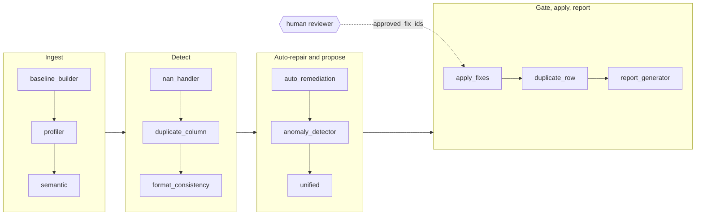

The workflow begins by grounding the dataset in a canonical model, then measuring it — against that model and against itself. Only once those measurements are formalised as typed artefacts does the system decide whether a finding is data-determined, judgement-requiring, or unfixable. After a fix executes, every column it touched is re-measured, so the report describes the dataset as delivered rather than as expected.

This serves two purposes. The first is **technical safety**: a stage that cannot measure cannot silently justify its own output, and a stage that cannot execute cannot act on a bad judgement. The second is **interpretability**: because every handoff is a typed object, a reader can point at any cell in the delivered file and trace it back to the operation, the proposal and the violation that produced it.

The same system can be read as **four layers**:

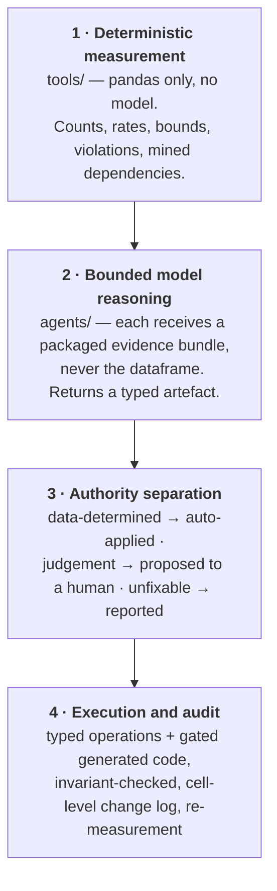

This is how two properties that normally trade off can coexist here: the system is **free to reason semantically** (layer 2) while remaining **unable to act on that reasoning unchecked** (layers 3 and 4).

### 2.2 The Two Knowledge-Base Files

The pipeline is grounded in two hand-curated files that together describe NoiPA's canonical data model: one states what a column should be, the other supports retrieval over those statements. Both were **written by hand from NoiPA open data**: we downloaded a set of published NoiPA datasets, read their fields, and distilled the recurring columns, domains and conventions into a registry. It is curation, not extraction — the registry states what a field *should* be, which no single file can tell you.

That provenance is also why `datasets_extra/` exists. Four further NoiPA files we downloaded — `assenzeMensili.csv`, `contributiPrevidenziali.csv`, `ritenuteSindacali.csv` and `trasferimentiPersonale.csv` — live there and are not among the two the brief requires. They exist to answer a question those two cannot: does the pipeline work on a NoiPA file it was not developed against, or is it fitted to the two it was? Section 4.10 reports one such run.

**`noipa_schema_registry.json`** is the canonical schema. It declares four domains — `Amministrati`, `Amministrazioni`, `Rapporti_di_lavoro`, `Trattamento_economico` — holding nineteen dataset definitions between them, plus a `shared_column_definitions` block of twelve reusable column contracts referenced by `$ref`. It also carries the global conventions the whole pipeline validates against:

```json
{
  "naming_convention": "snake_case_lower_with_uppercase_acronym_suffix",
  "naming_regex": "^[a-z][a-z0-9_]*(_[A-Z]{2,})?$",
  "encoding": "utf-8",
  "csv_separator": ",",
  "decimal_separator": ".",
  "k_anonymity_floor_for_person_counts": 6
}
```

`baseline_builder` resolves every `$ref` against the shared block and validates the whole structure into a `BaselineFile`, written out as `baseline.json` so that no downstream agent ever has to interpret a reference itself.

**`column_descriptions.json`** and its cached `.embeddings.pkl` are the retrieval index. Each canonical column carries a natural-language description and sample values; the pair is embedded once with `text-embedding-3-small` and cached to disk. This is what makes canonical matching work on columns whose names carry no signal — see Section 3.1.

### 2.3 Typed Artefacts as the Pipeline Contract

The defining engineering choice is that **every handoff between stages is a validated Pydantic model**, declared in `models.py`. A stage does not return prose, or a dict, or a dataframe with an understanding attached — it returns an object that either validates or fails loudly.

The contracts that carry the pipeline are `ColumnPayload` (what a column *means*), `ValidationReport` and `FormatViolation` (what is wrong with it, each violation tagged with a `ViolationKind`), `ImputationHint` (a mined dependency with its purity and coverage), `AnomalyReport`, `FixProposal` (a proposed repair as a sequence of typed `Operation`s), and `UnaddressedViolations` (a defect carried to the report with no fix and the reason why).

`Operation.kind` is a closed `Literal`, and this is deliberate — it is the enumeration of everything the system is capable of doing to a dataset:

```python
OperationKind = Literal[
    "replace_values", "normalize_numeric", "normalize_date", "normalize_period",
    "strip_whitespace", "collapse_casing", "round_decimals", "cast_dtype",
    "impute_from_lookup", "drop_column", "rename_column", "drop_duplicate_rows",
    "apply_generated_function",
]
```

In a pipeline of this class the main risk is not that a model returns something wrong — it is that it returns something **plausible that nobody can check**. A typed artefact converts that risk into a validation error at the boundary. It also makes it possible to dry-run a proposal before showing it to a human, to render it as equivalent `pandas` for review, and to reference a violation by a stable id from detection all the way to the report.

### 2.4 Detailed Pipeline Stages

#### 2.4.1 Ingest — grounding the dataset in a canonical model

`baseline_builder` resolves the registry (pure Python, no model). `profiler` sends a hierarchical signature map of the resolved baseline plus the input column names and 5-row samples, and identifies the **domain** and **language** of the dataset — the frame within which every later match is interpreted.

`semantic` then resolves each input column to a canonical definition through a **cascade**: a programmatic name and alias match first; where that is insufficient, embedding retrieval over `column_descriptions.json` proposes top-*k* candidates; the model then confirms or rejects each candidate by comparing descriptions, dtypes and sample values, and returns a `ColumnPayload`:

```json
{
  "column_name": "cod_imposta",
  "description": "Code identifying the specific tax withheld",
  "dtype": "string",
  "canonical_hint": "codice_imposta",
  "placeholders": ["N/D", "-"],
  "related_columns": ["imposta", "cod_tipoimposta"],
  "target_casing": "lowercase"
}
```

The `canonical_hint` is the value on which everything downstream depends: it determines which format spec applies, whether nulls are permitted, and which columns are considered related and therefore grouped together for remediation. A wrong hint does not merely produce a wrong match — it silently retargets three later stages. This is why the match is a cascade with an explicit model verdict rather than a similarity threshold.

The agent never receives the dataframe. It receives a bounded instance: the column name, dtype, a 30-row sample, the placeholder candidates found deterministically, and the retrieved canonical candidates with their descriptions.

#### 2.4.2 Detect — measuring against the schema and against itself

`nan_handler` **unmasks disguised nulls** using the per-column placeholder lists from the payload, then enforces the proposed dtype *non-destructively*: a column is cast only if every non-null value survives the cast, and blocking values are reported as violations rather than coerced away. It then records the full completeness analysis — fill rate per column and dataset-wide, missing values per row, sparse columns.

One guard deserves naming. A placeholder list is **refused if it matches more than 30% of a column**, because at that scale the list has stopped describing the gaps in the column and started describing the column's own vocabulary. Without it, a status column whose legitimate dominant value happens to resemble a placeholder token would be erased wholesale.

`duplicate_column` detects columns that hold the same field, elects a canonical name among them, and — importantly — picks the **data survivor by measured coherence, not by column order**, recording every cell backfilled, every cell where the survivor disagreed with the dropped column, and every value that existed only in the dropped one. Redundancy removed and data changed are reported separately.

`format_consistency` infers a format spec per column, validates against it, mines cross-column functional dependencies, and checks arithmetic identities between numeric columns.

**A subtlety that shapes the whole reporting design:** unmasking disguised nulls makes measured completeness go **down**. The pipeline therefore records quality at **three snapshots** — `raw` (the file as it arrived), `detected` (once placeholders are unmasked) and `final` (as delivered) — precisely so that *discovering* a hidden gap is never mistaken for *creating* one. See Section 4.1.

#### 2.4.3 Auto-remediation — what the data determines on its own

This is the one stage that writes to the dataset **before** the human gate, and the justification is narrow: it applies only corrections that are **deductions rather than judgement calls**, where holding them behind an approval would add no safety.

Four cases qualify: an unambiguous alternative layout for a period key; representation noise on a number of known recorded precision; a year or month that a period column states directly; and a gap fillable from a mined dependency of **purity ≥ 0.99**.

The boundary is drawn explicitly. When a period disagrees with a year or month that is *itself* well formed, neither side is demonstrably wrong — that is a choice about what a value *ought* to be, so those rows are reported as consistency violations and left to the Unified agent instead of being rewritten here.

Whatever this node rewrites, it **re-measures**, so every downstream agent reasons about the dataset as it now stands rather than as it arrived.

#### 2.4.4 Proposal — generated code and typed operations

`unified` groups columns by the transitive closure of `related_columns`, aggregates the upstream violations for each group, and asks the model for proposals. The split between the two kinds of remediation is the core design claim of the project:

- **Generated code for value-level repair.** The model writes a `clean_value(value)` function. It is a *pure scalar transform*: it never sees the dataframe, so it cannot change the row count and cannot reach another column. A format rule is thereby expressed as code that **generalises**, not as an enumeration of the values that happened to appear in the sample.
- **Typed catalogue operations for everything structural or data-creating** — `drop_column`, `rename_column`, `drop_duplicate_rows`, `impute_from_lookup`, `cast_dtype`. These are exactly the actions that can lose or invent data, and they stay bounded on purpose.

The prompt reflects this by *specifying the target*, not the answer. Each column carries `dominant_example_values` (up to 8 values that already conform — the function must return every one of them **unchanged**) and `example_inconsistent_values` (up to 8 that violate the format — the function must transform every one, or return `null` for those genuinely unrecoverable; returning one unchanged is a failure). The model is given the shape of correctness and must write a rule that reaches it.

Every proposal is then **dry-run against the dataset** and checked against `tools/fix_invariants.py` before a human ever sees it.

#### 2.4.5 The human approval gate

`apply_fixes` executes **only** the ids present in `state.approved_fix_ids`, and is a no-op otherwise. This is the mechanism, not a convention: there is no code path by which a proposal reaches the dataset without an explicit id in that list.

The gate itself is the Streamlit **Review and apply** view. For each proposal the reviewer sees the description, the rationale, the affected columns, the estimated row count, and **the code, rendered as executable Python**. Three actions are available: **Accept**, **Reject**, and **Revise**, where Revise sends natural-language feedback back to the Unified agent and re-proposes that group alone, leaving every other decision intact.

What that code *is* depends on which kind of repair the proposal carries, and the gate says which, because the distinction is the whole authority argument of Section 1.3 and a reviewer must not have to guess.

**A typed catalogue operation** is the common case — the great majority of proposals across the three recorded runs. The executed thing is a bounded `Operation` with validated parameters, so what the gate renders is the *equivalent* pandas expression, labelled as such:

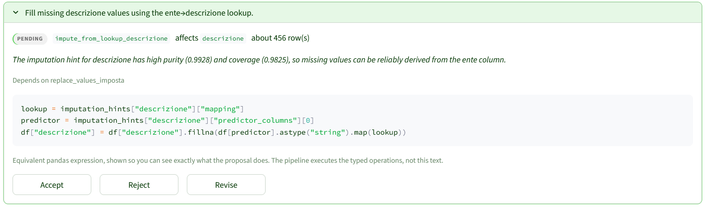

**A generated cleaning function** is the exception, and here the code block is not an illustration but the source that will actually run, so the caption changes to say so and to name the guarantees it already passed:

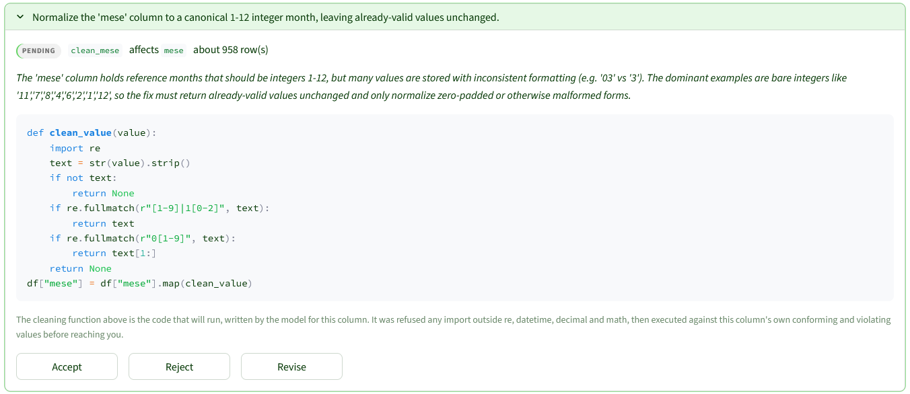

The difference is enforced in `app.py`, which selects the caption on whether the proposal carries an `apply_generated_function` operation. It matters because the two demand different things of the reader: the first asks whether the *action* is right, the second asks whether the *code* is right.

After execution the gate reports what actually landed, including **every approved fix that did not** — whether it errored, breached an invariant, or was skipped — so a silent partial application is impossible.

#### 2.4.6 Reporting — facts first, prose second

The system separates **what is true about the run** from **how it is described**. `report_generator` first recomputes the residual violations on the remediated dataset, derives the three-point quality metrics, and assembles a **fully deterministic payload** — every count, table and chart in the document. Only then is the model called, and it is asked exclusively for the *interpretation*: the verdict, one comment per coverage area, and the recommendations.

The prompt states this directly: *"You do not report figures. Every number, table and chart in the report is computed from the run and laid out before your text reaches the reader."* The consequence is structural — **a wrong number cannot enter the document through a sentence**, because sentences are not where numbers come from. `tests/test_report_truthfulness.py` enforces the property.

The report is emitted as Markdown, HTML and PDF, alongside the cleaned dataset and the cell-level change log.

### 2.5 The Reliability Score

The reliability score is computed in `tools/reliability_score.py` over **five dimensions**: `completeness`, `validity`, `consistency`, `uniqueness` and `schema_conformity`.

Two properties matter more than the formula. First, **every dimension divides by the units it actually evaluated**, not by the whole cell grid — a validity score over three columns that have a format spec is a statement about those three columns, and diluting it across eighteen would make it meaningless. Second, `compare()` scores the two ends of a run **over the same set of dimensions**, excluding any dimension that could only be measured at one end, so the delta is genuinely like-for-like rather than an artefact of what became measurable along the way.

The score is reported at the three snapshots described in 2.4.2, which is what makes the completeness behaviour in Section 4.1 legible rather than alarming.

### 2.6 Safety of Generated Code

Nothing executes generated source without passing through `tools/generated_function.py`. There are four layers, and they are not interchangeable.

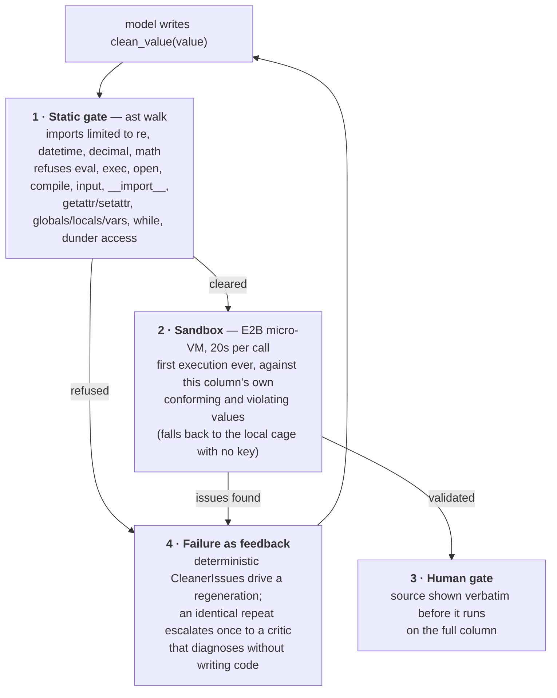

The **static gate** parses the source and walks the AST, refusing imports outside `re`/`datetime`/`decimal`/`math`, the names `eval`, `exec`, `open`, `compile`, `input`, `__import__`, `getattr`, `setattr`, `globals`, `locals`, `vars` and others, `while` loops, and any dunder attribute access. Builtins are replaced by an explicit safe list.

#### The sandbox, and why the first execution leaves this machine

The **sandbox** is the layer that answers a question the static gate cannot: *what does this code actually do when it runs?* A static gate reasons about source. Some intent only becomes visible on execution — a regex that backtracks catastrophically, a `decimal` context that raises, a transform that silently returns `None` for every value it was meant to repair. Finding that out requires running the code, and running it is exactly the act that carries the risk.

The project's position is that **the first execution of model-written source is not an act that belongs on the developer's machine**. That machine holds the raw dataset, the `.env` with three API keys, the git history and the reviewer's whole filesystem — and the code about to run was written seconds earlier by a language model, has never executed anywhere, and has been checked only by a parser. So it goes elsewhere: [`e2b-code-interpreter`](https://e2b.dev/docs) starts a **cloud micro-VM**, and the cleaner's first run happens inside it.

The mechanics are deliberately narrow. `tools/generated_function.py` builds a small driver script — the generated source, the list of values as a JSON literal, a `try/except` per value, and a single `print` of a marker-prefixed JSON line — and calls `Sandbox.run_code` with a **20-second timeout**. Nothing else crosses: no dataframe, no file, no credential, no network call of ours. What comes back is one line of text, parsed by marker. **The judgement of what those outputs mean never leaves this repository**: `_judge` decides deterministically, here, whether a dominant value was modified, an outlier left unchanged, or a result unparseable as the target dtype. The sandbox is asked only *what happened*, never *whether it was acceptable*.

Two lifecycle details matter in practice. One sandbox is **held open for a whole run** and reused across trials, because the repair loop re-checks a proposal at the top of every iteration and again when it settles — a fresh VM per check would cross the network dozens of times for the same source. That handle survives the call that created it, so `close_sandbox()` is called explicitly at the end of `agents/unified.py`: in a long-lived process such as the Streamlit gate an unclosed sandbox stays connected and billed for the whole session. Results are additionally **cached by `(source, values)`**, which is sound precisely because a cleaner is a pure scalar function.

**The fallback is a real degradation, and is recorded as one.** `E2B_API_KEY` is optional: with no key, or when the sandbox call fails, execution falls back to a **local cage** — `load_callable` behind a whitelist of builtins and a restricted import hook, in this process. That keeps the pipeline running offline, in CI and in the 348 tests, but it is a weaker guarantee and the system does not pretend otherwise.

Every execution is appended to an **execution log** (`{executor, ok, detail}`), carried in the state as `generated_function_runs` and printed in the delivered report as *"generated functions validated in a sandbox: N of M"*. A reader can therefore see whether the isolation the architecture claims actually applied to *their* run. Across the three recorded runs, **eight of eight** first executions happened in E2B and none in the local cage.

That log is also what caught the one bug in this layer. An earlier recording of `attivazioniCessazioni` logged 20 trials with only **10 in E2B**; the other 10 fell back, each failure carrying the same reason: `{"message":"The sandbox was not found","code":502} … likely due to sandbox timeout`. Reusing one sandbox for a whole run saves the network round-trips, but it also meant the VM's TTL, not the pipeline, decided how long the isolation lasted — and `Sandbox.create()` was being called with no explicit lifetime, so the provider's default expired part-way through a ten-minute run and every later trial went local without anything failing. `_open_sandbox` now passes a lifetime sized for a run, and `_run_in_sandbox` reopens the handle when a call reports the VM gone. Nothing about the fallback changed; what changed is that it is no longer reached by default.

One boundary should be stated plainly: **the sandbox isolates the host, but it does not restrain the code.** Inside the VM, refused source would run happily. It is the *static gate* that makes local execution on the full column safe, and the sandbox that makes the *first* execution safe to attempt at all. The two layers do different jobs and neither substitutes for the other.

The **failure path** is the fourth layer. A failed validation does not discard the function — it produces typed `CleanerIssue` objects (`forbidden_construct`, `runtime_exception`, `dominant_value_modified`, `outlier_unchanged`, `not_parseable_as_target_dtype`, …) which are fed back as deterministic evidence for another attempt. A failure that repeats **identically** escalates once to a critic model that diagnoses the bug without writing code, on the reasoning that a model repeating itself needs a different question, not another try.

### 2.7 Invariants: rules that are executed, not stated

`tools/fix_invariants.py` evaluates the before/after dataframes of every single proposal and refuses it if it:

- **changes the row count** outside a declared `drop_duplicate_rows`;
- **invents data** — fills missing values with no imputation hint backing them;
- **fills a column too sparse to speak for itself** — more than 50% empty before the fix;
- **deletes more than 2%** of a column's populated values beyond its declared placeholders;
- **splits a column into casing variants** it did not have before.

The sparsity invariant exists because of a specific bug: an imputation was once proposed on a column that was **98.5% empty**. The rule had been stated in the prompt, and the model ignored it — unnoticed, because nothing checked. The principle we drew from it governs the codebase: **a rule that can be checked by executing the fix belongs in code, not in a prompt.**

### 2.8 Design Choices and Prompt Strategy

**LangGraph** was chosen because the pipeline is a fixed sequence over a single shared state with an interruption point in the middle; a conversational or free-routing agent framework would have made that gate a convention rather than a mechanism. **Pydantic** carries the contracts because the alternative — dicts by agreement — is exactly the failure the project is arguing against.

The prompt strategy follows the same logic. **A prompt does not create the evidence.** The evidence has already been measured and packaged upstream; the prompt's job is to delimit what the agent may do with it: which evidence is authoritative, which single decision it is being asked to make, which facts it must not invent, and which typed output it must return. The Unified prompt is explicit that the agent proposes and never executes; the Report prompt is explicit that the agent interprets and never counts.

Prompts are versioned in git, one markdown file per LLM-calling agent, loaded through `utils/prompts.py` — so a prompt change is a reviewable diff rather than an edit buried in a string literal.

The model configuration in `utils/llm.py` is a **single construction point** for the whole system: one place to change the model, the temperature or the failure behaviour.

`temperature=0` with the provider's reasoning mode disabled bounds run-to-run variance, but does not remove it. Across repeated recordings of the same file the measurements reproduced exactly, while the proposal stage did not, and neither did the counts of the deterministic stages that run downstream of a model decision (Section 4, opening).

Schema-constrained answers take **two decoding paths**. Tool calling comes first; when the provider serialises malformed JSON or truncates at the output limit, the request is retried in JSON mode, whose constrained decoding cannot emit invalid JSON, with the schema carried in the prompt. An answer neither path produces raises `EmptyModelResponse`. A caller able to continue without that answer catches it, so one unanswerable column group costs that group and no more, rather than the whole run.

---

## 3. Experimental Design

The purpose of the project was not only to build the artefact but to understand **which architectural choices make an LLM pipeline reliable enough to be trusted with a repair**. In practice the project evolved through trial and error: several early designs proved too unconstrained, too opaque, or too difficult to verify, and were replaced by more bounded alternatives. The experiments below are those transitions. Each is documented in the repository's history.

### 3.1 From name matching to embedding retrieval for canonical matching

The first design resolved an input column to a canonical definition by **name similarity**. It failed immediately on the real datasets, because the columns that most need resolving are exactly the ones whose names carry no signal — `2cod_imposta`, `ente%code`, `cod imposta ext`. The adopted solution builds a retrieval index over `column_descriptions.json`, embedding `name + description + sample values` with `text-embedding-3-small`, ranking candidates by cosine similarity boosted by sample-value overlap and dtype agreement, and passing the top-*k* to the model for an explicit verdict.

- **Main Purpose**: determine whether semantic retrieval over descriptions resolves columns that name matching cannot.
- **Baseline**: programmatic name and alias matching alone.
- **Evaluation metrics**: **canonical match accuracy** against a hand-labelled ground truth for both datasets, and **abstention correctness** — how often the system correctly returns `NaN` for a genuinely novel column. The second metric matters as much as the first: a matcher that always guesses is worse than one that declines, because a wrong `canonical_hint` silently retargets three downstream stages.
- **Resulting design decision**: the cascade in `agents/semantic.py` — programmatic match first, retrieval second, model verdict last — with the embedding index cached to disk.

### 3.2 From free-form model edits to a typed operation catalogue, and back to bounded generated code

This took the longest to settle, and it produced the project's central design claim. The first remediation agent asked the model to **write arbitrary cleaning code** against the dataframe. It was powerful and unauditable: the code could drop rows, reach across columns and rewrite anything, and a reviewer had no bounded question to answer.

The reaction was to replace generated code entirely with a **typed operation catalogue**. This was safe and immediately too weak: a format rule became a `replace_values` mapping, i.e. an **enumeration of the values already observed**, which does not generalise to the next month's file.

The synthesis is the current split. Generated code returned, but confined to a `clean_value(value)` **pure scalar transform** that cannot see the dataframe — so it generalises as a rule while remaining structurally incapable of losing a row or reaching another column. Everything structural or data-creating stayed in the typed catalogue.

- **Main Purpose**: determine whether generalisation and safety can be obtained simultaneously by constraining the *interface* of generated code rather than its content.
- **Baselines**: (a) unrestricted generated code against the dataframe; (b) typed operations only.
- **Evaluation metrics**: **generalisation**, whether the rule corrects held-out violating values it was never shown rather than only the sampled ones; **conformance preservation**, whether all `dominant_example_values` are returned unchanged; and **reach**, the set of changes the mechanism makes structurally impossible. The third is the one that justifies the design: it is a property of the interface, not a rate to be measured.
- **Resulting design decision**: the two-track remediation of Section 2.4.4, plus the `apply_generated_function` operation as the only channel through which generated source reaches the data.

### 3.3 From prompt-stated rules to executable invariants

Early safety rules lived in the prompt: *do not invent data*, *do not fill a sparse column*. The failure was observed directly — an imputation proposed on a column **98.5% empty**. The prompt had said not to; nothing verified it, so nothing caught it.

- **Main Purpose**: determine whether safety properties stated in natural language are enforceable, or whether they must be executed.
- **Baseline**: the same rules as prompt instructions only.
- **Evaluation metrics**: **violation escape rate** — how many proposals breaching a stated rule survive to the human gate. The right metric here is not model accuracy but whether a breach is *detectable at all*, since an undetected breach and a compliant proposal are indistinguishable to a reviewer.
- **Resulting design decision**: `tools/fix_invariants.py`, evaluated on the before/after frames of every proposal in the dry run, and the standing rule that a checkable rule never lives only in a prompt.

### 3.4 From discarding a failed cleaner to failure-as-feedback with a critic escalation

The first generated-code loop **discarded** a function that failed validation and asked again with the same prompt, which reliably produced the same failure. The adopted design converts each failure into typed `CleanerIssue` objects — the offending input, the actual output, the expected behaviour — and feeds them back as deterministic evidence. A failure that repeats **identically** escalates once to a critic model that diagnoses without writing code.

- **Main Purpose**: determine whether a failed generation is more cheaply repaired than replaced.
- **Baseline**: regeneration from the unchanged prompt.
- **Evaluation metrics**: **repair rate within the attempt budget** and **model calls per accepted function**. Cost per accepted artefact is the honest metric here, because a loop that eventually succeeds after unbounded retries has not solved anything.
- **Resulting design decision**: the feedback loop in `agents/unified.py` with a single critic escalation on an identical repeat, and `prompts/cleaner_critic.md` as a diagnose-only prompt.

### 3.5 From one global completeness number to three measured snapshots

A single completeness figure made the pipeline look like it was **destroying data**: unmasking `N/D` as a null lowers measured completeness, so the system was penalised for finding the very defect it was built to find.

- **Main Purpose**: determine at which points quality must be measured for a before/after comparison to be honest.
- **Baseline**: one measurement on the raw file and one on the output.
- **Evaluation metrics**: **like-for-like validity of the delta** — whether the reported improvement is attributable to remediation rather than to a change in what was measurable. This replaced a headline "score improvement" number that was, on inspection, partly an artefact of measurement timing.
- **Resulting design decision**: the `raw` / `detected` / `final` snapshots, and `compare()` scoring both ends over the same dimension set.

### 3.6 Further decisions shaped by observed failures

1. **Anomaly method chosen from column role, not dtype.** Numeric-looking code columns were being IQR-scanned and reported as outlier-ridden; a numeric column with few distinct values is a code, whatever its dtype says.
2. **Duplicate-column survivor picked by measured coherence, not column order.** The original left-to-right rule discarded the better-populated column whenever it happened to appear second.
3. **Mined dependencies rejected when they shift over time.** A dependency that holds only within a period is not a rule; ambiguity was made to cost its own rows rather than the whole column.
4. **Enums no longer inferred from the frequent values of an open set**, which was turning free-text columns into closed vocabularies and generating violations for every legitimate new value.
5. **Every approved fix that fails to land is now reported**, skips included, after a silent partial application was observed.

Taken together these are not a benchmark suite. They document the process by which the final contribution emerged: **an LLM pipeline made accountable by dividing authority according to the kind of defect.**

---

## 4. Results

Results come from **three end-to-end runs**, each executed on the pipeline as committed with **every proposal approved** at the gate so that the full remediation path is exercised:

| Run | Dataset | Size | Role |
|---|---|---|---|
| §4.1 – §4.8 | `spesa.csv` | 7,543 × 18 | required by the brief; used as the readable case |
| §4.9 | `attivazioniCessazioni.csv` | 20,102 × 19 | required by the brief; the larger and harder of the two |
| §4.10 | `ritenuteSindacali.csv` | 11,745 × 14 | **not developed against** — a further NoiPA file, outside the brief |

`spesa.csv` is unpacked in detail first because it exhibits all five defect categories at once: disguised nulls, three-way column redundancy, header-convention drift, format drift inside a period column, and near-empty columns.

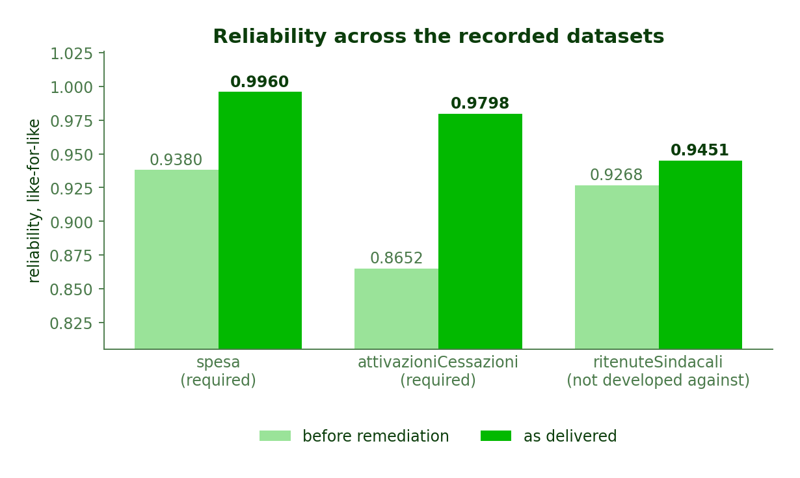

Approving everything is the *upper bound* on what the system will do, not its default. The point of the gate is that a reviewer can decline any of it; approving all of it is what makes the delta measurable.

One caveat on reproducibility, stated here because it bears on every number that follows. The **measurements are stable**: every recording of `spesa.csv` reproduced all three quality snapshots exactly — the same 7,543 x 18 arrival, the same 16,939 nulls, the same 988 disguised ones, the same delivered 0.9801 completeness — along with the duplicate resolution and the completeness analysis.

**The stages downstream of a model call are not.** The shape of that variance is worth stating precisely. Two independent recordings, one on an earlier revision of the code and one on the current one, agree cell for cell: 4,215 auto-remediated cells, 2,878 of them rounding `spesa` to its recorded precision, 5,659 cells changed in total, the same six proposals. An earlier third recording differed on all three: 4,324 auto-remediated cells, 2,987 of them rounded, and four proposals rather than six. Its artefacts were not kept, so that difference cannot be traced to a cause after the fact.

What makes such a difference possible is structural rather than random. `round_decimals` is deterministic, but it runs on `spesa` *after* `duplicate_column` has collapsed `{spesa, SPESA TOTALE}` into one column and backfilled it — and the two source columns disagree about how much rounding they need, 2,830 cells against 2,817. Which name survives that collapse is a model call. A deterministic stage is only as reproducible as the frame handed to it, which is the argument for measuring at both ends of a run rather than trusting a single number.

The figures below describe the specific runs recorded under `runs/`, not an average.

### 4.1 The reliability score, and why there are two of them

The headline result is that the pipeline raised the aggregate reliability score from **0.7562 to 0.9933**. That number is true but incomplete, and the report deliberately publishes a second one beside it.


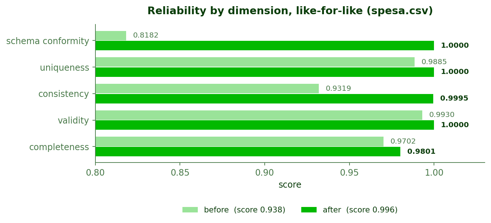

The two scores answer different questions. **As delivered** (0.7562 → 0.9933) compares only the three dimensions measurable on the raw file — completeness, uniqueness and schema conformity — because *validity* and *consistency* cannot be scored before the pipeline has inferred a format spec and mined the cross-column rules to score them against. **Like-for-like** (0.9380 → 0.9960) is the stricter comparison: it scores both ends over all five dimensions, using the pre-remediation snapshot taken once those specs exist.

The like-for-like figure is the smaller improvement and the more honest one, which is why `compare()` computes it and the report prints both. A system that quoted only the first would be taking credit for the arrival of its own measuring instruments.

Per dimension, the movements are **schema conformity 0.8182 → 1.0000** (the largest, and the one the human gate authorised), **consistency 0.9319 → 1.0000**, **validity 0.9930 → 1.0000**, **uniqueness 0.9885 → 1.0000**, and **completeness 0.9702 → 0.9801** — the smallest, and the one that needs explaining.

### 4.2 The completeness dip is the system working

Read naively, this figure shows the pipeline *destroying* data before recovering it.

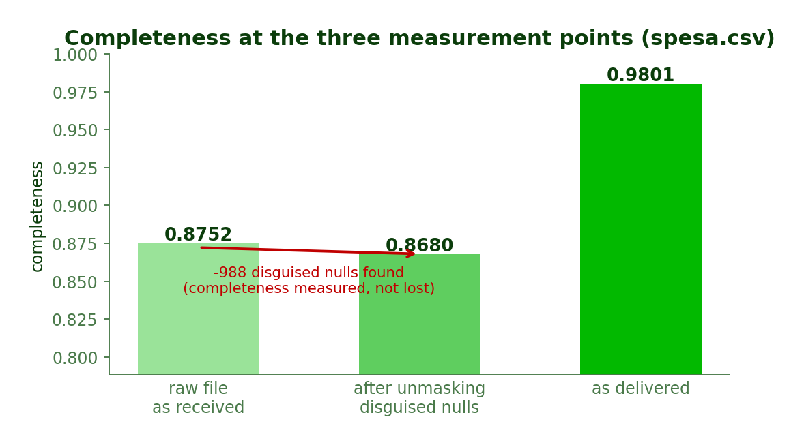

The raw file measures **0.8752** complete. After the pipeline unmasks disguised nulls it measures **0.8680**, which is *lower*. Nothing was lost between those two bars. **988 cells** that read as data to `pandas` (`N/D`, `-`, `?` and similar tokens) were nulls in disguise, and the second bar is the first honest measurement of the file. The report labels this explicitly as `hidden_defects_unmasked: {disguised_nulls_unmasked: 988, apparent_completeness: 0.8752, true_completeness: 0.8680}`.

This is precisely why quality is captured at three snapshots rather than two. Against the raw figure the delivered **0.9801** looks like a modest +0.010; against the true baseline it is **+0.112**, and it is the second number that describes what remediation actually achieved. A two-point measurement would have made the system's most valuable single behaviour — finding defects that are invisible to the naive check — register as a regression.

### 4.3 Detection and what remains

Across the five coverage areas the run detected **18,459 violations** and left **1,633** standing.

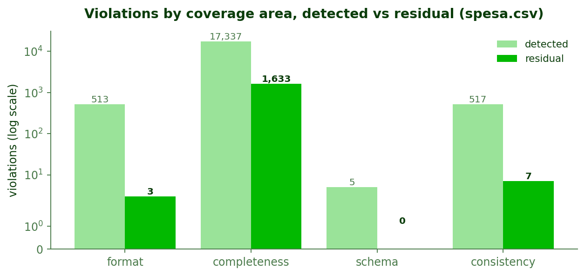

**Schema violations went 5 → 0**, **format violations 513 → 0**, **consistency 517 → 0** and **uniqueness 87 → 0**. **Completeness went 17,337 → 1,633**, a 90.6% reduction — and it is the only area with anything left standing.

The uniqueness figure counts rows rather than reports, and it is measured at the pre-remediation snapshot rather than on the raw file: 43 exact duplicate rows and 44 locked in a key collision at that point. The raw file carries 40 and 50 respectively — collapsing redundant columns turns some key collisions into outright duplicates, which is why the two snapshots disagree. Counting the validation reports alone reported zero here, which made a mandatory coverage area of the brief read as though it had never been checked.

The 1,633 residual nulls are the interesting number, because they are **not a failure to detect**. They break down as `area_geografica` (1,567), `spesa` (58) and `descrizione` (8), and every one of them is carried into the report as an `UnaddressedViolations` entry with a stated reason. The model's own justification, quoted from the run:

> *"[These] cannot be safely repaired because none of these columns has an imputation hint providing a deterministic rule to derive the missing value from other columns in the row. `area_geografica`, `note`, and `fonte_dato` are nullable by design and their absence is not a data defect that can be inferred; `spesa` is a monetary amount that must not be invented without a deterministic rule from the user. These require human judgement or source-record reconciliation."*

A system optimising for the headline number would have imputed all 1,633 and reported completeness 1.0000. The invariant in `tools/fix_invariants.py` forbids exactly that, and the residual count is the visible cost of the guarantee that nothing was invented.

### 4.4 What actually changed, and on whose authority

**5,659 cells** changed across the run. The split by origin is the clearest single picture of the authority argument in Section 1.3.

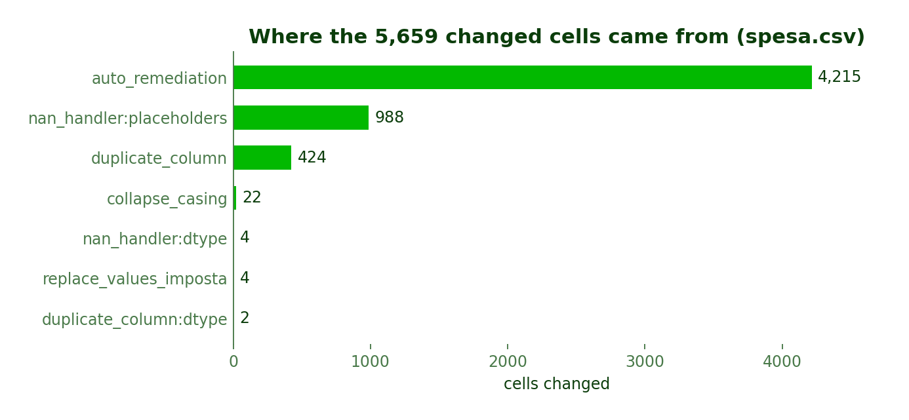

**Auto-remediation accounts for 4,215 cells (74.5%)** — the corrections the data determines on its own: 2,878 cells of floating-point noise rounded off `spesa` to its recorded two-decimal precision, 414 `rata` period labels rewritten to canonical form, 448 `descrizione` values filled from a mined `ente → descrizione` dependency at purity 0.9928, 379 `imposta` values filled likewise, and 96 partial periods completed. None of these required a human, because none of them required a *choice*.

**Null unmasking accounts for 988**, duplicate-column resolution for **424**, and casing collapse for **22**.

**The six human-approved proposals changed four cells between them** — and were nonetheless the highest-impact decisions in the run, because four of them were the only changes to the *shape* of the dataset: dropping `note` (98.0% null) and `fonte_dato` (99.0% null), renaming `_id` → `id` and `aggregation-time` → `aggregation_time` to satisfy the registry's naming regex. The other two were value-level and barely moved the file: a `replace_values` corrected four stray `imposta` entries, and an `impute_from_lookup` on `descrizione` found nothing left to fill because auto-remediation had already closed 448 of its 456 gaps. This is the division of authority visible in a single chart: the deterministic stages moved every value, and the human decided which columns should exist.

Combined with four duplicate-column groups collapsed automatically — `{ente, ente%code}`, `{tipo_imposta, Tipo Imposta}`, `{cod_imposta, 2cod_imposta, cod imposta ext}`, `{spesa, SPESA TOTALE}` — the dataset went from **18 columns to 11**, and from **7,543 rows to 7,478** after 65 exact duplicates were removed.

That duplicate count is itself a second-order effect worth noting: the raw file contained **40** exact duplicate rows, but **65** were removed. Collapsing seven redundant columns made twenty-five further row pairs identical that had previously differed only in a duplicated column's spelling.

### 4.5 Anomalies are reported, not corrected

The anomaly stage flagged two columns and corrected neither, which is the intended behaviour.

On `imposta` it found two rare categories, `'imposta x'` (3 occurrences, 0.04%) and `'Altro'` (1 occurrence, 0.01%), against a dominant vocabulary in which `'Previdenziali a carico del datore di lavoro'` alone holds 11.61%. On `spesa` it found **1,352 IQR outliers** above an upper bound of ≈1.58M, ranging up to ≈43.4M. The second is the instructive case: in a public expenditure dataset a 43M figure is not an error, it is a large administration, and a system that "corrected" it would be destroying the most important rows in the file. The report states the finding and leaves the judgement to a reader.

The `spesa` outliers were left in place. The four rare `imposta` values were not, but the reason is worth being precise about: they were corrected by a `replace_values` proposal grounded in the mined `cod_imposta → imposta` dependency, which the reviewer approved — not because they were rare. That is the policy working as intended. Rarity alone never justifies a change; a mined dependency does, and the anomaly stage is not what acted on it.

### 4.6 Where the run spends its time

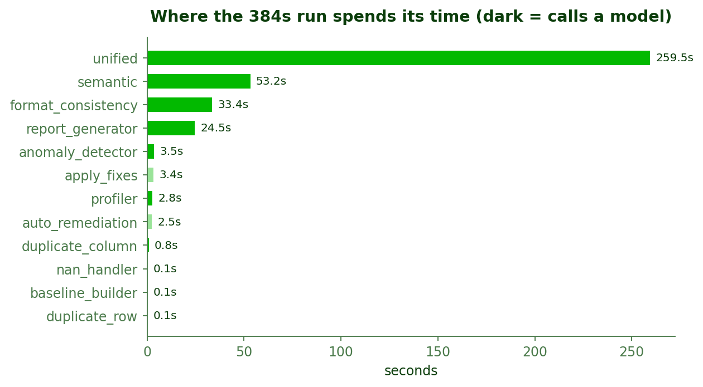

The full run took **659.1 seconds**. `unified` alone accounts for **361.2s — 55% of the total** — because it is the stage that calls a model per column group, validates what comes back, and retries on failure. `format_consistency` (84.2s) is second, reaching the model through two tools, and `semantic` (72.5s) third, calling it once per column. `apply_fixes` (42.5s), `auto_remediation` (36.8s) and `report_generator` (35.8s) follow.

The architectural point is at the other end of the chart. The stages that only measure are effectively free: `duplicate_row` **0.62s**, `nan_handler` **0.79s**, `baseline_builder` **1.01s** — and together with `auto_remediation` (36.8s, the one deterministic stage that also writes), in **39 seconds of the 659**, they changed **5,207 of the 5,659 cells (92.0%)**. The expensive stages are the ones that reason; the cheap stages are the ones that measure and act. That is the intended cost profile, and it is what makes the design affordable: pushing work down into deterministic tools is not only safer, it is where the throughput is.

### 4.7 A caveat on this particular run

**On this run the Unified agent wrote no code.** Six proposals reached the reviewer: four deterministic schema ones from `tools/schema_proposals.py`, and two value-level repairs — an `impute_from_lookup` on `descrizione` and a four-cell `replace_values` on `imposta` — both expressed as **typed catalogue operations** rather than a generated `clean_value`. The code-generation path of Sections 2.4.4 and 2.6 was therefore **not exercised on `spesa.csv`**.

A previous run of the same file proposed nothing at the value level at all, declaring the same column group unaddressable — the run-to-run variance noted at the head of this section. Neither run produced a generated function: given a choice between writing code and selecting a bounded operation, the agent chose the bounded operation both times.

The other two datasets did exercise the code-generation path, and Sections 4.9 and 4.10 report what it produced.

### 4.8 Summary of run outcomes

| Metric | Raw file | Detected | As delivered |
|---|---|---|---|
| Rows | 7,543 | 7,543 | **7,478** |
| Columns | 18 | 18 | **11** |
| Cells | 135,774 | 135,774 | **82,258** |
| Null cells | 16,939 | 17,927 | **1,633** |
| Exact duplicate rows | 40 | 40 | **0** |
| Rows in key conflict | 50 | 0 | **0** |
| Badly named columns | 7 | 7 | **0** |
| Sparse columns | 2 | 2 | **0** |
| Redundant columns | 1 | 1 | **0** |
| Completeness | 0.8752 | 0.8680 | **0.9801** |
| Uniqueness | 0.9881 | 0.9947 | **1.0000** |
| Schema conformity | 0.5000 | 0.5000 | **1.0000** |

| Run metric | Value |
|---|---|
| Violations detected | 18,459 |
| Violations residual | 1,633 |
| Cells changed | 5,659 |
| Disguised nulls unmasked | 988 |
| Auto-remediations applied | 5 operations, 4,215 cells |
| Proposals put to the reviewer | 6 |
| Proposals approved and applied | 6 (0 errors, 0 refused) |
| Duplicate-column groups collapsed | 4 |
| Generated cleaning functions | 0 |
| **Reliability, as delivered** | **0.7562 → 0.9933** |
| **Reliability, like-for-like** | **0.9380 → 0.9960** |
| Total runtime | 659.1s |

### 4.9 The second required dataset: `attivazioniCessazioni.csv`

`attivazioniCessazioni.csv` is the harder of the two files the brief requires: **20,102 rows × 19 columns**, 2.7× the size of `spesa`, with **eight** badly named columns and **five** duplicate-column groups against `spesa`'s four. Its header row alone carries `Provincia Sede`, `CODICE ENTE`, `3descrizione`, `regione%sede` and — a space inside a word — `att ivazioni`.

The pipeline detected **50,315 violations** and left **7,343**, carrying reliability from **0.8652 to 0.9798** like-for-like (0.7448 → 0.9919 as delivered). It unmasked **2,888 disguised nulls**, collapsed 19 columns to **12**, removed **90** duplicate rows, and changed **8,246 cells**.

Three things distinguish this run from `spesa`.

**The registry gave it almost nothing to hold on to.** The Profiler identified the domain as `Rapporti_di_lavoro`, but of the file's 19 column names exactly **one** — `anno` — appears anywhere in the curated registry, and the closest registry dataset shares that single name. The run therefore leaned overwhelmingly on **inferred** format specs and **mined** cross-column rules rather than on canonical grounding. That it still reached 0.9798 is good evidence that the deterministic layer carries the system where the knowledge base is thin.

**Auto-remediation did the cross-column work.** Two mined rules dominate the file — `RATA determines mese` (1,702 rows breaking) and `RATA determines anno` (1,160 rows breaking) — and `auto_remediation` repaired 958 of those rows by deriving month and year directly from the period key, plus 802 period labels normalised.

**The gate saw two generated cleaning functions.** `clean_mese` corrected `mese` values inconsistent with the month encoded in `RATA`, and `clean_cessazioni` coerced negative `cessazioni` counts to zero. Both were written against the column's own conforming and violating values, cleared the static gate, and were executed off-host before the reviewer saw them. The execution log makes the isolation auditable rather than assumed: across the run there were **6** generated-function trials and **all six ran in the E2B sandbox**, with no fallback to the local cage.

An earlier recording of this same file read very differently — 20 trials, 10 in the sandbox and 10 on the host — and finding out why is what the log is for. `Sandbox.create()` was called without an explicit lifetime, the provider's default expired part-way through a ten-minute run, and every later trial fell back silently. `tools/generated_function.py` now opens the VM with a lifetime sized for a run and reopens it if a call reports it gone. The guarantee that can degrade quietly is the one that has to be logged per trial.

### 4.10 Generalisation: a held-out dataset

The canonical registry and the retrieval index in this repository were built by hand from **NoiPA open data**. Alongside the two files the brief requires, we downloaded four further NoiPA datasets — `assenzeMensili.csv`, `contributiPrevidenziali.csv`, `ritenuteSindacali.csv` and `trasferimentiPersonale.csv` — which live in `datasets_extra/`. The pipeline was never developed or tuned against any of them, so they answer a question the two required files cannot: does it work on a NoiPA file it was not built around?

`ritenuteSindacali.csv` — trade-union dues, **11,745 rows × 14 columns** — is the sharpest test of the four. The registry does carry an `EntryRitenuteSindacali` definition, but it describes a different aggregation of the same subject: eight columns cut by province, age band and sex, where this file is cut by union and month. Only **two** of the file's fourteen column names, `amministrazione` and `comparto`, appear anywhere in the registry. It also uses a different identifier convention (`id_record`, a UUID, rather than `_id`) and carries an arithmetic identity between three of its columns.

The pipeline handled it without a single error: **15,300 violations detected, 1,276 left standing**, a 91.7% reduction, with reliability moving **0.9268 → 0.9451** like-for-like. It is the weakest of the three improvements, and that is the point of running it.

- **Completeness closed entirely.** It went 0.9258 → **1.0000** — every one of the 12,245 completeness violations resolved, not one null cell in the delivered file, after 441 disguised nulls were unmasked and three mined dependencies filled 852 cells.
- It mined **four cross-column rules with no registry help at all**, including the arithmetic identity `differenza = importo_ritenuto - importo_versato` and `descrizione_sindacale determines sigla_sindacale` (779 rows breaking, all repaired).
- It normalised 807 union acronyms in `sigla_sindacale` and filled the `comparto` placeholders from the `amministrazione` lookup — both through **typed catalogue operations**, not generated code. Two cleaners were tried and executed in the sandbox; neither ended up in a proposal.
- It removed **88** duplicate rows and collapsed the one duplicate-column group present.

**And this is where the limits show.** Of the 1,276 violations left, **1,020** are rows breaking `differenza = importo_ritenuto - importo_versato`, left standing deliberately for the reason given below. The other 256 are the honest cost of thin grounding: **174 format violations** the run could not express a repair for, and **82 rows** still locked in key collisions, reported rather than resolved. Schema conformity did not move at all across the run. On the file the registry was built around, four of five dimensions closed to 1.0000; here, one did.

**Two things it did not do, both correctly.** The arithmetic identity was declared unaddressable, with the model naming the real reason: *"recomputing a value based on two other columns, but the available operations only work on a single column at a time."* That is a real bound on the typed catalogue, and the agent reported it rather than proposing something it could not deliver. And the missing `codice_amministrazione` values were left alone, because no column determines them.

### 4.11 The three runs side by side

| | `spesa` | `attivazioniCessazioni` | `ritenuteSindacali` |
|---|---|---|---|
| Role | required | required | **not developed against** |
| Rows × columns, raw | 7,543 × 18 | 20,102 × 19 | 11,745 × 14 |
| Columns delivered | 11 | 12 | 12 |
| Column names known to the registry | 1 of 18 | 1 of 19 | 2 of 14 |
| Disguised nulls unmasked | 988 | 2,888 | 441 |
| Violations detected → residual | 18,459 → 1,633 | 50,315 → 7,343 | 15,300 → 1,276 |
| Cells changed | 5,659 | 8,246 | 13,940 |
| Duplicate rows removed | 65 | 90 | 88 |
| Duplicate-column groups | 4 | 5 | 1 |
| Proposals, all approved | 6 | 7 | 3 |
| Generated cleaning functions | 0 | 2 | 0 |
| Generated-function trials, in the sandbox | 0 of 0 | **6 of 6** | **2 of 2** |
| Cross-column rules mined | 5 | 2 | 4 |
| Completeness | 0.8752 → **0.9801** | 0.8773 → **0.9758** | 0.9258 → **1.0000** |
| **Reliability, like-for-like** | 0.9380 → **0.9960** | 0.8652 → **0.9798** | 0.9268 → **0.9451** |
| Runtime | 659.1s | 628.2s | 523.0s |
| Errors | 0 | 0 | 0 |

Read together, the three runs support a narrower claim than any one of them would alone. The system is **not fitted to the two files it was developed against**: on a held-out dataset from a domain its registry does not cover, it mined four cross-column rules unaided and closed completeness entirely. But the improvement there is visibly the smallest of the three, and schema conformity did not move at all — the further a file sits from the registry, the more of its defects the pipeline can only name. The residual column is equally part of the result: across all three files it left standing every defect for which it had no evidence-backed repair, and named the reason in the report rather than closing the gap by inventing a value.

---

## 5. Conclusions

### 5.1 Main Takeaway

The three runs support a narrower claim than "the pipeline improves data quality", and the narrower claim is the one worth making: **the system improved every dataset it was given while remaining able to account for each change it made, and it declined the changes it could not account for.**

Concretely, on `spesa.csv` it raised like-for-like reliability from **0.9380 to 0.9960**, eliminated **100%** of schema, format, consistency and uniqueness violations, reduced completeness violations by **90.6%**, removed **7 redundant or empty columns** and **65 duplicate rows**, and changed **5,659 cells**, each one recorded in a cell-level change log naming the stage responsible. On the larger `attivazioniCessazioni.csv` it went **0.8652 → 0.9798** with only one of nineteen column names known to the registry. On `ritenuteSindacali.csv`, a file it was never developed against, it went **0.9268 → 0.9451**, closing completeness entirely and mining four cross-column rules unaided.

The result on the held-out file is the one we would defend hardest, because it is the one that shows the system is not fitted to the two datasets it was developed against.

The shape of that improvement matters as much as its size. **75% of the cells were changed by deterministic auto-remediation**, on evidence strong enough that a human decision would have added nothing: mined dependencies at purity ≥ 0.99, a column's own recorded decimal precision, an unambiguous period layout. The human gate was reserved for the **structural** decisions — which columns to drop, which to rename — that no measurement can settle.

And **1,633 nulls were deliberately left in place.** No imputation hint supported them, so the invariants refused to fill them and the report explains why for each column. That number is not a shortfall against a target; it is the visible price of the guarantee that the pipeline never invented a value. A system built to maximise a completeness score would have reported 1.0000 and been worth less.

The defensible conclusion is therefore not that an LLM can clean data. It is that **an LLM pipeline can be made accountable for data repair when authority is divided by the kind of defect** — deterministic tools measuring, models reasoning only over bounded evidence, typed operations bounding what can be executed, invariants enforcing what a prompt cannot, and a human owning every decision that changes the shape of the data.

### 5.2 Observed Failure Modes

Several concrete failure modes emerged during development, and they are worth naming because they justify safeguards that would otherwise look over-cautious.

**Imputation on a near-empty column.** A fix was proposed to fill a column that was 98.5% empty. What little such a column holds cannot speak for what it does not; the safeguard is the sparsity invariant in `tools/fix_invariants.py`.

**Cleaning functions that enumerate instead of generalising.** Given eight violating example values, a model will happily write a function that maps those eight and returns everything else unchanged. It passes the examples and fails the column. The safeguard is validation against held-out conforming and violating values, with `outlier_unchanged` as an explicit issue category.

**Placeholder lists that describe the column's vocabulary.** A placeholder list matching most of a column is no longer describing gaps. The safeguard is the 30% share guard in `nan_handler`.

**Enums inferred from an open set.** Taking the frequent values of a free-text column as an enum turns every legitimate new value into a violation. The safeguard is the cardinality check in `profile_format_spec`.

**Silent partial application.** Approved fixes that errored or were skipped once vanished without trace, leaving the reviewer believing more had been applied than had. The safeguard is that `apply_fixes` now surfaces every approved id that did not land.

**Identical regeneration loops.** A model asked the same question after a failure gives the same answer. The safeguard is failure-as-feedback plus a single critic escalation.

### 5.3 Limitations

Several limitations are **deliberate design constraints** rather than accidental gaps.

The **canonical registry is hand-curated for NoiPA**. The system is grounded in a specific institutional data model and is not domain-general; applying it elsewhere means writing a new registry, not retraining anything.

**Anomalies are reported, not corrected.** An outlier is unusual, which is not the same as wrong. The system deliberately declines to act on statistical unusualness alone, and leaves it for a person to judge unless a value is impossible.

**Duplicate detection is exact plus key-collision, not fuzzy record linkage.** Records that differ by a typo in a key are surfaced as conflicts, not resolved. Genuine entity resolution is out of scope.

**The report's narrative is model-written.** It is structurally prevented from introducing figures, and `tests/test_report_truthfulness.py` enforces that, but its *interpretation* is not proved correct beyond that constraint.

**The strongest isolation guarantee is the one that can silently degrade.** The sandbox is the only safety layer in the system that depends on a third party being reachable: without `E2B_API_KEY`, or when the call fails, the first execution of generated code happens in the local cage instead. The fallback is intentional — a pipeline that stops because a VM could not be started is worse than one that continues behind the static gate — and it is logged per trial rather than hidden, but it means the claim *"model-written code never runs on the host first"* holds for a configured run and not for every run. It took the log to notice that an unbounded sandbox lifetime had been quietly voiding it for half the trials of one run; Section 4.9 tells that story.

**Single-provider dependency.** Every chat call goes through one model pinned in `utils/llm.py`. This buys reproducibility and a single place to change; it also means provider availability is a hard dependency of any live run.

**Proposals can duplicate work auto-remediation has already done.** The Unified agent reasons about the violations detected *upstream* of auto-remediation, so it may propose a repair that has since been applied — in the recorded `spesa.csv` run it proposed 456 `descrizione` imputations of which auto-remediation had already filled 448, the remaining 8 being unfillable; it was approved, executed without error, and changed nothing. The outcome is safe (the dry run and the invariants both pass, and the operation is idempotent) but it spends a reviewer's attention on a decision that no longer matters. The fix is to re-scope the violation set handed to `unified` against the post-auto-remediation state.

**Generated code cannot express a cross-column repair.** The scalar-transform interface that makes `clean_value` safe — it never sees the dataframe — also makes it structurally unable to derive a value from another column. Such repairs must go through the typed catalogue, and where the catalogue has no matching operation the violation is carried to the report unaddressed rather than repaired.

**Run-to-run reproducibility holds for the measurements, not for everything downstream of a model.** Every recording of `spesa.csv` produced identical quality snapshots and completeness analyses. The proposal stage did not: three recordings produced six, four and six proposals. Nor did the auto-remediated cell counts, and the reason is that a deterministic stage inherits the variance of the frame handed to it — `round_decimals` runs on a column `duplicate_column` has just collapsed, and which name survives that collapse is a model call. `temperature=0` bounds the variance; it does not remove it.

**The gate assumes an informed reviewer.** The system shows the generated source verbatim, which is the right thing to show, but it presumes someone able to read it. A reviewer who approves everything gets a system with much weaker guarantees than the architecture nominally provides.

### 5.4 Future Work

The most direct extension is **learning from gate decisions**: the accept / reject / revise record is a labelled dataset of what a domain expert considers a good repair, and nothing currently consumes it. Feeding rejection feedback back into the Unified prompt across runs would let the system converge on a particular administration's conventions.

A second direction is **widening the operation catalogue under the same discipline** — adding fuzzy record linkage as a typed, invariant-checked operation rather than as free code, which is precisely the pattern Section 3.2 established.

A third is **automating registry construction**. The registry is currently the main cost of onboarding a new domain; deriving a candidate registry from a corpus of that domain's files, for human correction rather than human authorship, would make the approach portable at a reasonable cost.

Finally, the pipeline currently runs **one dataset at a time**. Many of the defects it detects — a code drifting in meaning, a dependency decaying — are only visible *across* monthly files. Extending the state to carry a history would turn several one-shot checks into trend detection.
