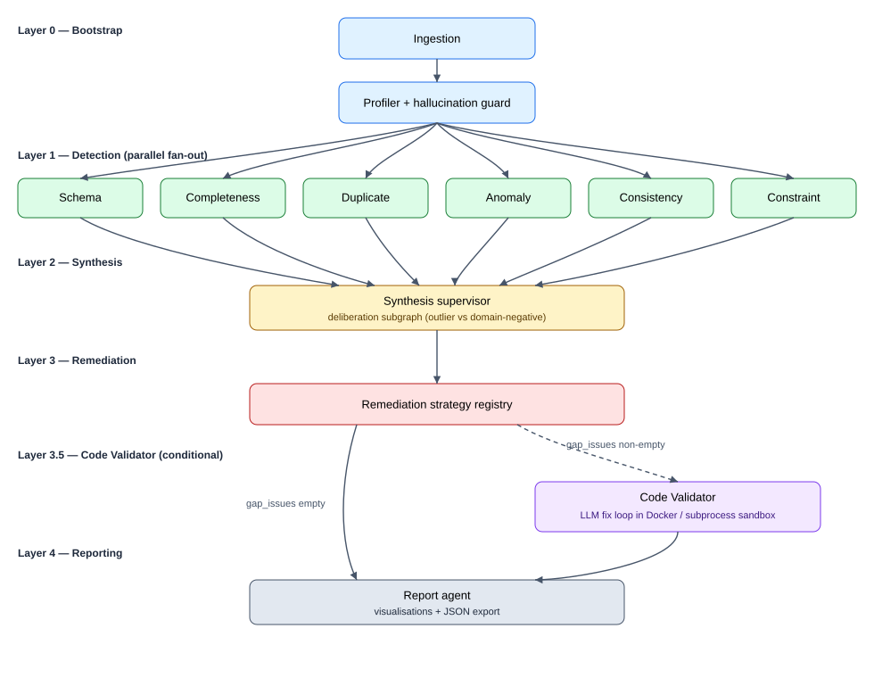

# NoiPA — Multi-Agent Data Quality Pipeline

A Supervisor-style multi-agent system that ingests Italian Public Administration
(NoiPA) datasets, detects quality issues across six dimensions
(schema, completeness, consistency, anomaly, constraints, duplicates),
automatically remediates what can be safely fixed, flags the rest for human
review, and produces a multi-dimensional reliability score before and after
remediation.

---

## Quickstart

```bash
git clone <repo-url>
cd Reply_multi-agents_project_810431
python -m venv .venv
source .venv/Scripts/activate                  # macOS/Linux: source .venv/bin/activate
pip install -e ".[dev]"
cp .env.example .env                           # fill in ANTHROPIC_API_KEY / OPENAI_API_KEY
make smoke-mocked                              # offline smoke test, ~3 s
make app                                       # launches the Streamlit dashboard
```

Without `make` (e.g., native Windows `cmd`) the equivalent commands are listed
in [Targets](#targets).

---

## What it does

NoiPA datasets are heterogeneous: schema drift between snapshots,
locale-specific placeholders (`N.D.`, `n.c.`, `sconosciuto`), comma-decimal
amounts (`1.234,56`), currency-suffixed values (`€2500`), Italian month names,
and free-text intrusions in tightly-scoped columns. The pipeline addresses
this with twelve agents organised in five layers:

| Layer | Purpose |
| ----- | ------- |
| 0 — Bootstrap | Ingestion + LLM-driven dataset profiler with hallucination guard |
| 1 — Detection | Six parallel detectors: schema, completeness, duplicate, anomaly, consistency, constraint |
| 2 — Synthesis | Supervisor merges per-agent reports, runs cross-agent conflict resolution, escalates contested issues to a deliberation subgraph |
| 3 — Remediation | Ordered strategy registry (e.g., `MissingValuesStrategy`, `LocaleNumericStrategy`, `LookupImputationStrategy`); residuals are queued for the code validator |
| 3.5 — Code Validator | Generates filter + fix code via LLM, validates with an AST guard, executes inside a sandbox; applies if safe, flags for human review otherwise |
| 4 — Reporting | Computes post-remediation score, six visualisations, JSON export |

The full layer-by-layer description, including the exact contract between
agents and the orchestration shape, is in
[`docs/architecture.md`](./docs/architecture.md).

---

## Architecture at a glance



The same diagram is also embedded as Mermaid in
[`docs/architecture.md`](./docs/architecture.md), which renders inline on
GitHub.

Key components:

- **Orchestration:** LangGraph `StateGraph` compiled in
  `agents_demo/_graph.py`. Layer-1 detectors fan out in parallel; their
  list-typed contributions to `state.agent_log` and
  `state.cross_agent_insights` use `operator.add` reducers so branches do not
  clobber one another.
- **Typed LLM I/O:** PydanticAI `Agent` instances in
  `agents_demo/_llm_clients.py`. Every LLM call returns a Pydantic model;
  retries, timeouts, and provider failover (Anthropic primary, OpenAI
  secondary) are handled by `FallbackModel`.
- **Single shared state:** `state_demo/pipeline_state.PipelineState`, projected
  into a `TypedDict` mirror so LangGraph can route it across nodes.

---

## Reliability score

Five weighted dimensions:

| Dimension | Weight | Computation |
| --------- | ------ | ----------- |
| Schema conformity | 20 | 1 − (issue columns) / total columns |
| Completeness | 25 | 1 − (missing cells) / total cells |
| Uniqueness | 20 | 1 − (duplicated rows) / rows |
| Consistency | 20 | 1 − (date-order violations) / rows |
| Anomaly freedom | 15 | 1 − (3-σ outliers) / numeric values, when numeric values exist |

The weighted mean × 100 is the headline 0–100 score. The dimensions are
recomputed at three pipeline checkpoints (`post_synthesis`,
`post_remediation`, `post_code_validator`) to drive the trajectory chart.
Implementation: `state_demo/scoring.py::compute_reliability_score`.

---

## Italian-locale handling

A first-class concern, not an afterthought:

- **Comma-decimal coercion** (`1.234,56` → `1234.56`) gated by a
  per-column regression guard so the strategy never widens the type
  distribution.
- **Currency-symbol stripping** while preserving sign and decimal precision.
- **Italian month names**, including the `mar` collision with English March;
  the registry in `state_demo/locale_it.py` keeps Italian and English forms
  separate.
- **Italian placeholder vocabulary** (`sconosciuto`, `non disponibile`,
  `da verificare`, …) — detected as missing-with-context, not as legitimate
  values.
- **Codice fiscale heuristic** for ID-column inference (16 alphanumeric,
  uppercase, predictable letter/digit positions).

---

## Sandbox and security

The Code Validator runs LLM-generated `fix(df, col)` functions inside a
sandbox before applying them.

- **Primary:** Docker, `python:3.12-slim`, network disabled
  (`network_mode="none"`), read-only root filesystem, all capabilities
  dropped, `no-new-privileges`, runtime limits (`mem_limit`, `cpu_quota`,
  `pids_limit=64`), `nobody:nobody` UID. The runner script is embedded
  inline in `tools_code_validator.py::_RUNNER_SCRIPT` — no script file is
  mounted.
- **Fallback:** Hardened Python subprocess. On POSIX hosts the fallback
  enforces `RLIMIT_CPU` and `RLIMIT_AS` via `resource.setrlimit`; on Windows
  the rlimit calls degrade silently, leaving the AST guard plus restricted
  `__builtins__` whitelist as the only defences.
- **AST guard** (`tools.py::validate_generated_code`): rejects forbidden
  imports, dunder gadgets, `exec`/`eval`/`open`/`compile`, attribute
  access matching `__*__`, code longer than 4000 characters or with more
  than 500 AST nodes, and any deviation from the single-`fix(df, col)`
  signature.
- **Post-fix safety guards:** quantitative-change cap, numeric-type drift
  check, LLM review pass on the produced diff.

---

## Configuration

Settings live in `state_demo/config.py` (Pydantic Settings, hydrated from
environment variables). Model identifiers, sandbox tunables, and
provider-failover order live there and **only** there — never hard-coded in
agent modules.

Required environment variables (see `.env.example`):

| Variable | Purpose |
| -------- | ------- |
| `ANTHROPIC_API_KEY` | Primary LLM provider |
| `OPENAI_API_KEY` | Secondary fallback provider |
| `LOG_LEVEL` | `DEBUG` / `INFO` / `WARNING` (default `INFO`) |
| `MODEL_TIER_DEFAULT` | `smart` or `fast` (default `smart`) |
| `DOCKER_HOST` | Optional, only when Docker daemon is non-default |

Switching providers (Gemini, DeepSeek, Mistral, Bedrock) is a one-line change
in `Settings.models` — PydanticAI supports them all natively.

---

## Project structure

```
state_demo/                   configuration, typed Issue model, locale registry, scoring, deliberation
agents_demo/                  one file per agent + LangGraph wiring + PydanticAI clients
agents_demo/remediation_strategies/   one file per strategy in STRATEGY_ORDER
tools.py                      stateless detection / fix functions
tools_code_validator.py       sandbox utilities for the code validator
app_demo.py                   Streamlit dashboard
data/examples/                synthetic Italian-locale demo CSVs (clean, dirty, large)
Datasets-Reply-20260313/      real NoiPA samples (read-only)
tests/                        51 test files: unit, integration, tools coverage
docs/                         architecture, presentation outline, decision log
scripts/smoke_test.py         end-to-end pipeline smoke test
.github/workflows/ci.yml      lint + type + tests
```

The authoritative layout is in [`CLAUDE.md`](./CLAUDE.md).

---

## Testing and quality gates

```bash
make lint          # ruff format --check + ruff check
make type          # mypy
make test          # fast unit + integration suite (excludes docker, slow)
make cov           # full coverage report
make smoke-mocked  # end-to-end smoke with stubbed LLM (no API credits)
make ci            # lint + type + test + cov in sequence
```

Coverage thresholds (enforced from this step onward): ≥ 80 % on `tools.py`,
≥ 70 % overall. The `docker`-marked tests run only when a Docker daemon is
reachable; the `slow`-marked tests are excluded from the default run.

### Targets

If `make` is unavailable (e.g., native Windows `cmd`), run the underlying
commands directly:

| `make` target | Equivalent command |
| ------------- | ------------------ |
| `install` | `python -m pip install -e ".[dev]"` |
| `lint` | `python -m ruff format --check . && python -m ruff check .` |
| `type` | `python -m mypy .` |
| `test` | `python -m pytest -q -m "not docker and not slow"` |
| `cov` | `python -m pytest -q -m "not docker and not slow" --cov=state_demo --cov=agents_demo --cov=tools --cov=tools_code_validator --cov-report=term-missing` |
| `smoke-mocked` | `python -m scripts.smoke_test --mocked` |
| `app` | `python -m streamlit run app_demo.py` |

---

## Limitations

1. **Italian-locale heuristics.** The placeholder vocabulary, the comma-decimal
   regression guard, and the month-name registry are tuned for Italian text.
   On non-Italian datasets the heuristics either no-op or, in the case of
   ambiguous tokens (`mar`, `dic`), can fire on tokens that look Italian. The
   pipeline degrades gracefully but the locale-specific differentiator is
   lost.
2. **Reliability score is opinionated.** The five-dimension weighted mean is
   one defensible scoring, not an industry standard. The weights
   (20/25/20/20/15) were chosen to penalise missing data slightly more than
   schema drift, reflecting the NoiPA payroll context. Different domains may
   want different weights.
3. **Profiler is LLM-driven.** The dataset fingerprint that drives Layer-1
   detection is produced by an LLM call. The Step-8 hallucination guard
   demotes claims that disagree with the data (e.g., a `must_equal`
   constraint that fails on > 20 % of rows), but the guard is a check, not a
   guarantee. Two runs on identical inputs can produce slightly different
   fingerprints.
4. **Sandbox falls back to AST-guard-only on Windows.** When the Docker
   daemon is unreachable on a POSIX host, the subprocess fallback enforces
   `RLIMIT_CPU` and `RLIMIT_AS`. On Windows, those calls are unavailable —
   the AST guard plus the restricted `__builtins__` whitelist are the only
   defences against malicious LLM output. A warning is logged at first
   fallback so this is not silent, but operators should be aware.
5. **No cross-table referential integrity.** Each dataset is processed
   independently. Foreign-key relationships between, say, an employee
   roster and a payment ledger are out of scope; the pipeline cannot
   detect that an `employee_id` referenced in payments is missing from the
   roster.
6. **No persistent cross-run memory.** Memory is scoped to a single
   `PipelineState` instance. The pipeline does not learn from prior runs;
   running it twice on similar files repeats every LLM call.

Future-work candidates (not committed): persistent memory layer,
multi-table referential checks, per-dataset score-weight calibration,
extension to non-Italian locales.

---

## Documentation

| Document | Purpose |
| -------- | ------- |
| [`CLAUDE.md`](./CLAUDE.md) | Operating contract for any AI agent working on the repo |
| [`Implementation Plan v2.md`](./Implementation%20Plan%20v2.md) | The 14-step roadmap and traceability matrix |
| [`docs/architecture.md`](./docs/architecture.md) | Layer-by-layer architecture, contracts, orchestration |
| [`docs/cleanup_decisions.md`](./docs/cleanup_decisions.md) | Every decision taken under uncertainty during the refactor |
| [`docs/presentation_outline.md`](./docs/presentation_outline.md) | 12-slide outline mapped to concrete artefacts |

---

## License

Proprietary. See `pyproject.toml`. License terms TBD — to be finalised
before public release.

---

## Acknowledgements

NoiPA / Ministero dell'Economia e delle Finanze for the data context;
the LangGraph and PydanticAI maintainers for the orchestration and typed
LLM I/O primitives that made this design tractable.
