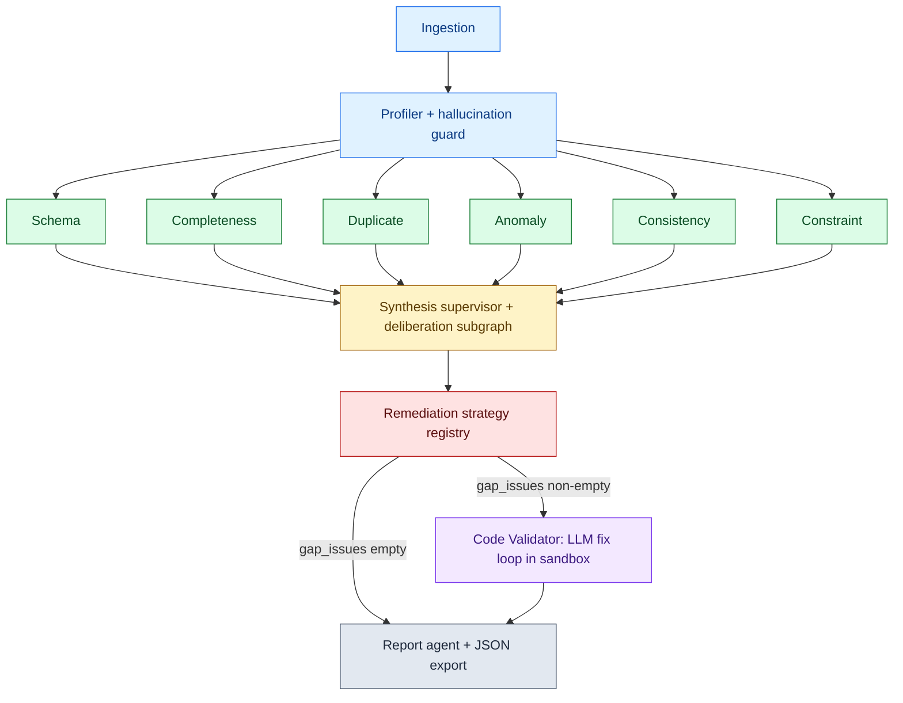

# Architecture

A single-page reference for the NoiPA multi-agent data-quality pipeline.
Implementation details live in the source; this page captures the **shape**
of the system: the layers, the agents, the contracts between them, and how
LangGraph orchestrates the whole thing.

## Pipeline diagram

The same diagram is also exported to `docs/pipeline.svg` for environments
that do not render Mermaid natively.

## Layers

### Layer 0 — Bootstrap

| Agent          | Module                              | Responsibility |
| -------------- | ----------------------------------- | -------------- |
| `IngestionAgent` | `agents_demo/ingestion_agent.py`  | Load CSV / JSON / Excel / Parquet from `state.source_path`. Records `state.df_raw` and `state.ingestion_meta`. |
| `ProfilerAgent`  | `agents_demo/profiler_agent.py`   | LLM-driven dataset fingerprint (domain, language, ID and date columns, numerical/categorical split, sparse columns, declared constraints). The Step-8 hallucination guard demotes profiler claims that disagree with the data (e.g., a "must_equal" constraint that fails on > 20 % of rows). |

### Layer 1 — Detection (parallel fan-out)

Six detectors fan out from the profiler and rejoin at synthesis. They emit
typed `Issue` instances (the discriminated union in
`state_demo/issues.py`) into per-agent `*_report` fields on `PipelineState`.

| Agent              | Detects |
| ------------------ | ------- |
| `SchemaAgent`      | Mixed types, invalid dates, naming-convention violations. |
| `CompletenessAgent`| Missing values, placeholder sentinels (`N.D.`, `n.c.`, `sconosciuto`), sparse columns. |
| `DuplicateAgent`   | Duplicate rows, value-equivalent or semantically duplicate column pairs, key-collision records. |
| `AnomalyAgent`     | Statistical outliers (3×IQR), rare categories, lookup-imputable mappings. |
| `ConsistencyAgent` | Date-format inconsistency, case inconsistency, conditional completeness, date-order violations. |
| `ConstraintAgent`  | Domain-negative values, format-pattern violations, float-precision noise, monotonically suspicious year/month columns. |

### Layer 2 — Synthesis

`SynthesisAgent` (`agents_demo/synthesis_agent.py`) is the supervisor. It:
- merges the per-agent reports into `state.prioritized_issues`;
- runs the column-convergence pass (issues stacking on the same column lift severity);
- runs four cross-agent conflict patterns (profiler-vs-schema mixed-type, profiler-vs-schema date dispute, duplicate-vs-lookup, outlier-vs-domain-negative);
- routes pattern 4 ("outlier vs domain-negative") through a **deliberation subgraph** in which the contesting specialists vote and a supervisor LLM tie-breaks. Outcomes are recorded as `DeliberationOutcome` instances in `state.deliberation_log`;
- computes the pre-remediation reliability score and snapshots it as `post_synthesis` in `state.dimension_trajectory`.

### Layer 3 — Remediation

`RemediationAgent` (`agents_demo/remediation_agent.py`) is a thin TAOR
orchestrator over `agents_demo/remediation_strategies/`. Each strategy in
`STRATEGY_ORDER` is responsible for one issue family
(e.g., `MissingValuesStrategy`, `DuplicateRowsStrategy`,
`PlaceholderStrategy`, `LocaleNumericStrategy`). The order is deliberate:
naming convention first, lookup imputation before median/mode, locale
fixes before numeric coercion. After all strategies have run, an LLM
gap-detection pass enqueues residual issues into `state.gap_issues` for
the code validator. The post-remediation snapshot lands as
`post_remediation` in the dimension trajectory.

### Layer 3.5 — Code Validator

`CodeValidatorAgent` (`agents_demo/code_validator_agent.py`) runs only
when `state.gap_issues` is non-empty AND
`Settings.pipeline.enable_code_validator` is true. For each gap issue:
1. Generate a filter expression via the LLM (max 3 retries with
   feedback);
2. Generate a `fix(df, col)` function via the LLM (max 3 retries);
3. Validate the code with the AST guard in `tools.validate_generated_code`
   (forbidden imports, dunder gadgets, single `fix(df, col)` signature,
   code-length and AST-node caps);
4. Execute it in the sandbox via `tools_code_validator.run_sandboxed`:
   Docker primary (network disabled, read-only rootfs, dropped caps,
   `nobody` UID, mem/cpu/pids limits); on a Docker miss, hardened
   subprocess fallback with `resource.setrlimit` on POSIX;
5. Run the post-fix safety guards (quantitative change cap,
   numeric-type drift, LLM review).

The outcome (applied or flagged for human review) is appended to
`state.fix_log` or `state.human_review_items`. The post-validator
snapshot lands as `post_code_validator` in the trajectory.

### Layer 4 — Reporting

`ReportAgent` (`agents_demo/report_agent.py`) computes the
post-remediation score, generates six visualisations
(severity distribution, by-agent breakdown, before/after completeness
heatmap, reliability dimension comparison, dimension trajectory,
issue-resolution Sankey) and assembles the `final_report` dict. The
exporter `serialize_report` round-trips typed `Issue` and
`DeliberationOutcome` instances via `model_dump`.

## State and orchestration

The shared mutable state is `state_demo/pipeline_state.PipelineState`,
projected into a `TypedDict` mirror in `agents_demo/_graph.py` so
LangGraph can route it across nodes. Two list fields use `operator.add`
reducers so parallel Layer-1 branches concatenate their contributions
instead of clobbering them: `agent_log` and `cross_agent_insights`.

`build_pipeline_graph(settings)` compiles the `StateGraph` shown above.
Each agent class exposes `as_node()` (factory wrapping `BaseAgent.run`)
so adding or swapping an agent is one entry in the graph builder.

## LLM I/O

Every LLM call is typed by PydanticAI: an `Agent` is built per output
schema, with provider failover (Anthropic primary →
OpenAI secondary) handled by `FallbackModel`. Model identifiers come
from `state_demo/config.Settings.models` — never hard-coded in agent
modules. Retries and timeouts live in the PydanticAI client; agent
code only sees `call_llm(...)` and `call_llm_json(..., schema=...)`.

## Reliability score

Five weighted dimensions:

| Dimension          | Weight | Computation |
| ------------------ | ------ | ----------- |
| Schema conformity  | 20     | 1 − (type/naming issue columns) / total columns |
| Completeness       | 25     | 1 − (missing cells) / total cells |
| Uniqueness         | 20     | 1 − (duplicated rows) / rows |
| Consistency        | 20     | 1 − (date-order violations) / rows |
| Anomaly freedom    | 15     | 1 − (3-σ outliers) / numeric values, only if numeric values exist |

The weighted mean × 100 is the headline 0–100 score. Dimensions are
recomputed at three pipeline checkpoints (`post_synthesis`,
`post_remediation`, `post_code_validator`) to drive the trajectory chart.

## Sandbox and security

The Docker primary uses `python:3.12-slim`, network disabled
(`network_mode="none"`), read-only root filesystem, all capabilities
dropped, `no-new-privileges`, runtime limits
(`mem_limit`, `memswap_limit`, `cpu_quota`, `pids_limit=64`), tmpfs at
`/tmp`, and the `nobody:nobody` UID (65534:65534). The runner script is
embedded inline in `tools_code_validator.py::_RUNNER_SCRIPT` so there is
no script file to mount and no filesystem path the sandbox can escape
through.

When Docker is unreachable (probed once per process via
`client.ping()`), the dispatcher falls back to a Python subprocess. On
POSIX hosts the fallback enforces `RLIMIT_CPU` and `RLIMIT_AS` via
`resource.setrlimit`; on Windows the rlimit calls degrade silently and
the AST guard plus restricted `__builtins__` whitelist (`len`, `range`,
`min`, …) remain the only defences. A single warning is logged at the
first fallback to alert the operator.

The AST guard rejects forbidden imports (`os`, `sys`, `subprocess`,
`socket`, `ctypes`, `shutil`, …), forbidden calls (`exec`, `eval`,
`open`, `compile`, `__import__`, `globals`, `locals`, `vars`,
`getattr`, `setattr`, `delattr`), forbidden attribute calls (`system`,
`popen`, `Popen`, `run`, …), the dunder-set gadgets (`__class__`,
`__bases__`, `__subclasses__`, `__globals__`, …), and any
attribute access whose name starts and ends with `__`. Code is also
capped at 4000 characters and 500 AST nodes, and the top-level body
must contain exactly one `fix(df, col)` function with no `*args`,
`**kwargs`, defaults, or kw-only parameters.

## See also

- [`CLAUDE.md`](../CLAUDE.md) — the operating contract for any AI agent
  working on the repo.
- [`Implementation Plan v2.md`](../Implementation%20Plan%20v2.md) — the
  14-step roadmap and traceability matrix.
- [`docs/cleanup_decisions.md`](./cleanup_decisions.md) — every
  decision taken under uncertainty during the refactor.
- [`docs/presentation_outline.md`](./presentation_outline.md) — the
  12-slide PPT outline mapped to concrete artefacts.
